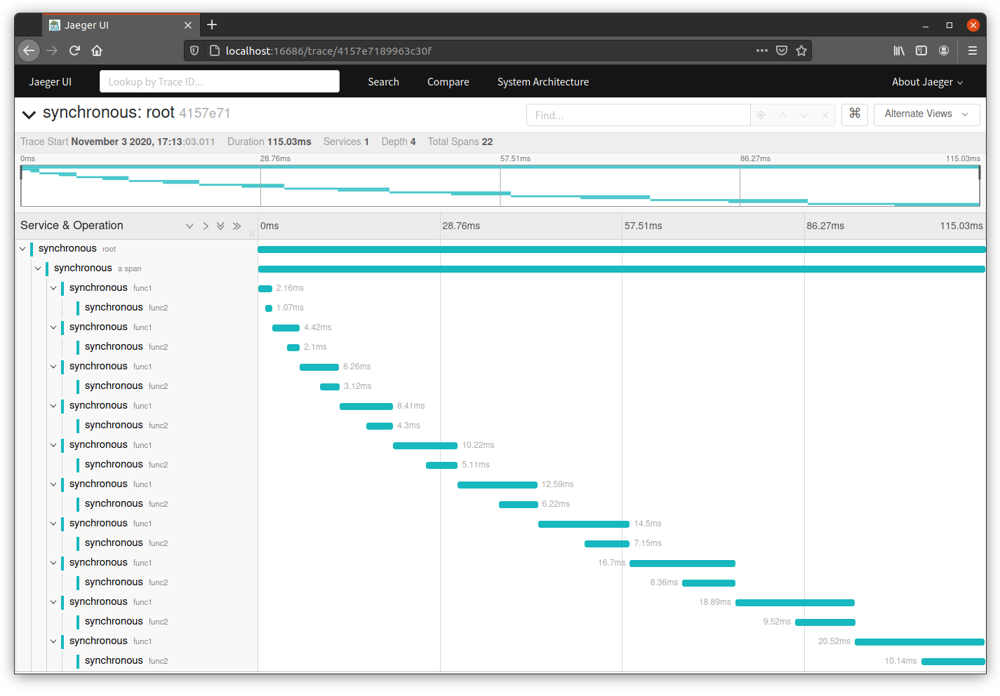
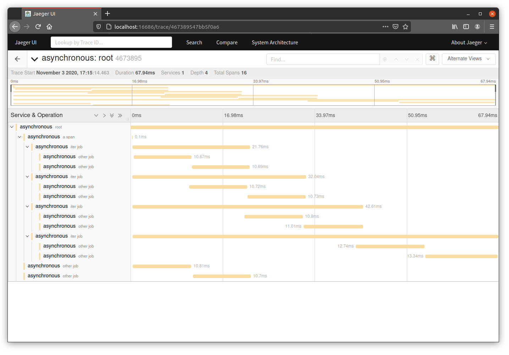

# Minitrace
[](https://github.com/tikv/minitrace-rust/actions)
[](https://github.com/tikv/minitrace-rust/blob/master/LICENSE)

A high-performance, ergonomic timeline tracing library for Rust.


## Concepts

### Span

  A `Span` represents an individual unit of work done. It contains:
  - An operation name
  - A start timestamp and finish timestamp
  - A set of key-value properties

### Local Span Guard

  A `LocalSpanGuard` is used to record a `Span`. Its creation means a `Span`'s begin and its destruction means a `Span`'s
  end.
  
  A `LocalSpanGuard` is thread-local and can be created by function `new_span()`.

  *Note: The relation between `Span`s is constructed implicitly. Even within a deeply nested function calls, the inner
  `LocalSpanGuard` can automatically figure out its parent without explicitly passing any tracing context as a parameter.*

### Scope

  A `Scope` is used to trace the execution of a task.
  
  `Scope` is thread-safe so it's okay to send or access across threads. Cloning a `Scope` will produce another `Scope` 
  which will trace the same task. After dropping all `Scope`s related to a task, a `Span`, representing the whole execution
  of the task, will be recorded.

  A new `Scope` can be created by function `root_scope()` and `child_scope()`, as mentioned [here](#Asynchronous Example).

### Local Scope Guard

  A `LocalScopeGuard` can gather spans on a thread during its own lifetime. Generally, the `LocalScopeGuard` should be held
  until the thread will not run for the task.
  
  A `LocalScopeGuard` is thread-local and can be created by `Scope`'s method `start_scope()`.
  
  *Note: Multiple `Scope`s can `start_scope` on the same thread. In which case, recorded spans will be shared for all `Scope`s.*


### Collector

  A `Collector` associated to a root `Scope` is used to collect all spans related to a request.


## Usage

```toml
[dependencies]
minitrace = { git = "https://github.com/tikv/minitrace-rust.git" }
```

### Record a Span

To record a common span:
```rust
use minitrace::new_span;

let _span_guard = new_span("my event");
```

To add properties:

```rust
use minitrace::new_span;

// add a property for a span
let _span_guard = new_span("my event").with_property(|| ("key", String::from("value")));

// or add multiple properties for a span
let _span_guard = new_span("my event").with_properties(|| {
    vec![
        ("key1", String::from("value1")),
        ("key2", String::from("value2")),
    ]
});
```

###  Synchronous Example

A common pattern to trace synchronous code:

- Create a root `Scope` and a `Collector` via `root_scope`, then create `LocalScopeGuard` via `start_scope`.
- Add `new_span`s somewhere, e.g. at the beginning of a code scope, at the beginning of a function, to record spans.
- Make sure the root `Scope` and all guards are dropped, then call `Collector`'s `collect` to get all `Span`s.


```rust
use minitrace::{new_span, root_scope, Span};

let collector = {
    let (root_scope, collector) = root_scope("root");
    let _scope_guard = root_scope.start_scope();

    let _span_guard = new_span("child");

    // do something ...

    collector
};

let spans: Vec<Span> = collector.collect(true, None, None);
```

### Asynchronous Example

To trace asynchronous code, we usually transmit `Scope` from one thread to another thread.

The transmitted `Scope` is of one of the following types:

- Clone from an existing `Scope`, will trace the same task as the origin `Scope`
- Create via `child_scope`, will trace a new task related to the origin task

You can choose one of the variants to satisfy the semantic of your application.

#### Threads

```rust
use minitrace::{child_scope, new_span, root_scope, Span};

let collector = {
    let (root_scope, collector) = root_scope("task1");
    let _scope_guard = root_scope.start_scope();

    let _span_guard = new_span("span of task1");
    
    // To trace the same task
    let scope = root_scope.clone();
    std::thread::spawn(move || {
        let _scope_guard = scope.start_scope();

        let _span_guard = new_span("span of also task1");
    });
    
    // To trace a new task
    let scope = child_scope("task2");
    std::thread::spawn(move || {
        let _scope_guard = scope.start_scope();

        let _span_guard = new_span("span of also task2");
    });

    collector
};

let spans: Vec<Span> = collector.collect(true, None, None);
```

#### Futures

We provide three future adaptors:

- `in_new_span`: will call `new_span` at every poll
- `in_new_scope`: create a new scope via `child_scope`, will call `start_scope` at every poll
- `with_scope`: accept a `Scope`, will call `start_scope` at every poll

The last two adaptors are mostly used on a `Future` submitting to a runtime.

```rust
use minitrace::FutureExt as _;
use minitrace::{root_scope, Span};

let collector = {
    let (root_scope, collector) = root_scope("root");
    let _scope_guard = root_scope.start_scope();

    // To trace the same task
    let scope = root_scope.clone();
    runtime::spawn(async {
        
        let _ = async {
            // some works
        }.in_new_span("");
        
    }.with_scope(scope));

    // To trace another task
    runtime::spawn(async {
        
        let _ = async {
            // some works
        }.in_new_span("");
        
    }.in_new_scope("new task"));

    collector
};

let spans: Vec<Span> = collector.collect(true, None, None);
```

### Macros

We provide two macros to help reduce boilerplate code:

- trace
- trace_async

For normal functions, you can change:
```rust
use minitrace::*;

fn amazing_func() {
    let _span_guard = new_span("wow");

    // some works
}
```
to
```rust
use minitrace::*;
use minitrace_macro::trace;

#[trace("wow")]
fn amazing_func() {
    // some works
}
```

For async functions, you can change:
```rust
use minitrace::*;

async fn amazing_async_func() {
    async {
        // some works
    }
    .in_new_span("wow")
    .await
}
```
to
```rust
use minitrace::*;
use minitrace_macro::trace_async;

#[trace_async("wow")]
async fn amazing_async_func() {
    // some works
}
```

To access these macros, a dependency should be added as:

```toml
[dependencies]
minitrace-macro = { git = "https://github.com/tikv/minitrace-rust.git" }
```

## User Interface

We support visualization provided by an amazing tracing platform [Jaeger](https://www.jaegertracing.io/).

To experience, a dependency should be added as:
               
```toml
[dependencies]
minitrace-jaeger = { git = "https://github.com/tikv/minitrace-rust.git" }
```

### Report to Jaeger

```rust
use minitrace_jaeger::Reporter;
use std::net::{Ipv4Addr, SocketAddr};

let spans = /* collect from a collector */;

let socket = SocketAddr::new(Ipv4Addr::new(127, 0, 0, 1).into(), 6831);
let reporter = Reporter::new(socket, "service name");

const TRACE_ID: u64 = 42;
reporter.report(TRACE_ID, spans).expect("report error");
```

### Setup Jaeger
```sh
docker run --rm -d -p6831:6831/udp -p16686:16686 --name jaeger jaegertracing/all-in-one:latest
```

### Run Synchronous Example

```sh
cargo run --example synchronous
```

Open http://localhost:16686 to see the results.



### Run Asynchronous Example

```sh
cargo run --example asynchronous
```

Open http://localhost:16686 to see the results.


